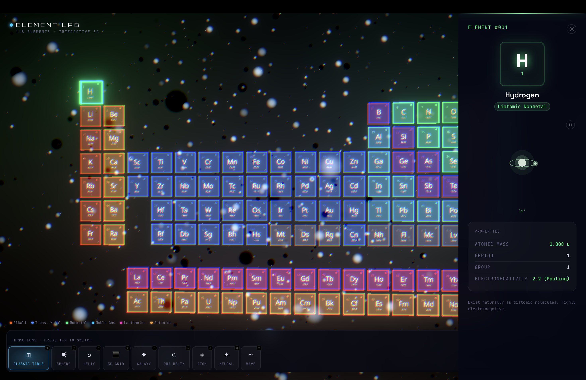

# ⚗️ Element Laboratory — Interactive 3D Periodic Table

Ultra-premium cinematic 3D visualization of all 118 chemical elements.
Built with Next.js, React Three Fiber, and custom GLSL shaders.



> **На русском?** Читайте [ЗАПУСК.md](ЗАПУСК.md) — пошаговая инструкция для запуска на своём компьютере.

---

## 🚀 Running the project

```bash
# Install dependencies
npm install

# Start development server
npm run dev
```

Then open **http://localhost:3000**

> **Note for macOS:** If you get an SWC binary error, run from your own terminal
> (not through an app sandbox). Alternatively:
> ```bash
> /opt/homebrew/bin/node node_modules/.bin/next dev
> ```

---

## 🎮 Controls

| Action | Control |
|--------|---------|
| Switch formation | Press **1–9** or click the bottom bar |
| Orbit / rotate | **Click + drag** |
| Zoom | **Scroll** |
| View element details | **Click** any card |
| Close modal | **Escape** or click the X |
| Toggle audio | **M** or click the audio button |
| Fullscreen | **F** or click the fullscreen button |

---

## ✨ Formations (press 1–9)

| Key | Formation | Description |
|-----|-----------|-------------|
| 1 | Classic Table | Standard IUPAC periodic table layout |
| 2 | Sphere | Fibonacci lattice on a sphere |
| 3 | Helix | Single helical arrangement |
| 4 | 3D Grid | 5×5×5 three-dimensional cube |
| 5 | Galaxy | 3-arm logarithmic spiral galaxy |
| 6 | DNA Helix | Double helix structure |
| 7 | Atom | Electron shell orbital arrangement |
| 8 | Neural | Random 3D neural network cloud |
| 9 | Wave | Ripple wave surface |

---

## 🏗️ Architecture

```
src/
├── app/              Next.js App Router
├── types/            TypeScript interfaces
├── data/elements.ts  All 118 elements data
├── lib/
│   ├── formations.ts 9 formation position calculators
│   └── colors.ts     Neon category color palette
├── store/useStore.ts Zustand global state
├── hooks/useAudio.ts Web Audio API procedural synth
└── components/
    ├── Scene/        Three.js / R3F components
    │   ├── Scene.tsx         Main canvas + scene root
    │   ├── ElementCard.tsx   Individual 3D card with GLSL shader
    │   ├── ParticleField.tsx Background particles
    │   ├── Effects.tsx       Bloom + ChromaticAberration
    │   └── CameraController  Smooth orbit + auto-drift
    └── UI/           Framer Motion UI overlays
        ├── LoadingScreen.tsx  Cinematic loading sequence
        ├── HUD.tsx            Main heads-up display
        ├── FormationPicker.tsx Bottom formation selector
        └── ElementModal.tsx   Element detail panel
```

---

## 🔧 Tech Stack

- **Next.js 14** — Framework
- **React Three Fiber** — Declarative Three.js
- **@react-three/drei** — Stars, OrbitControls, Text
- **@react-three/postprocessing** — Bloom, ChromaticAberration, Vignette
- **Framer Motion** — UI animations
- **Zustand** — Global state
- **Custom GLSL** — Glass + neon card shader
- **Web Audio API** — Procedural ambient synth

---

## 🎨 Visual Style

- Black background + volumetric neon bloom
- 12-category color coding (orange, blue, green, cyan, magenta...)
- Custom glass/neon card shader with animated border pulse
- Cinematic postprocessing pipeline
- Spring physics transitions (stiffness 0.055, damping 0.87)

---

## 🔮 Future Improvements

1. **Element search** — real-time highlight by name/symbol/property
2. **More formations** — torus, cube spiral, tree of life
3. **Electron visualization** — animated 3D orbital diagrams on click
4. **AR mode** — WebXR overlay on phone camera
5. **Category filter** — hide/show element categories
6. **Timeline mode** — animate through element discovery history
7. **3D sound** — positional audio per element (Web Audio API PannerNode)
8. **Export** — screenshot / share current formation as image
9. **Physics** — gravity mode with Box2D-style collisions
10. **VR** — @react-three/xr headset support
